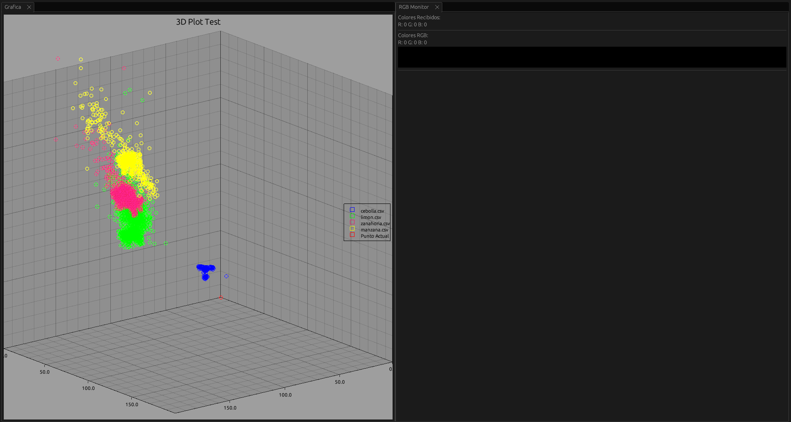
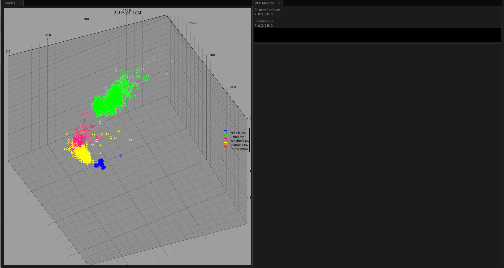

# Clasificador de Frutas con Arduino y TCS3200

Este proyecto es un sistema de clasificación de frutas que utiliza un Arduino junto con el sensor de color TCS3200. El sensor TCS3200 detecta colores midiendo la intensidad de la luz reflejada, lo que permite identificar y clasificar frutas basándose en sus colores. Además, he desarrollado una interfaz en Rust para visualizar los resultados y hacer más fácil la interacción con el sistema.

---

## Tabla de Contenidos

- [Introducción](#introducción)
- [Requisitos](#requisitos)
- [Instalación y Configuración](#instalación-y-configuración)
  - [Código para Arduino con PlatformIO](#código-para-arduino-con-platformio)
  - [Interfaz en Rust](#interfaz-en-rust)
- [Uso del Sistema](#uso-del-sistema)
- [Notas Adicionales](#notas-adicionales)

---

## Introducción

Este sistema de clasificación de frutas usa un Arduino conectado a un sensor TCS3200 para 
medir el color de las frutas. Los datos recogidos se procesan con Inteligencia Artificial para determinar la categoría
de la fruta basándose en su color. 
Esto puede ser útil para automatizar procesos en la industria alimentaria o para 
proyectos educativos y de experimentación.

El proyecto está compuesto por:
- **Código en Arduino:** Desarrollado y gestionado con PlatformIO, que se encarga de leer el sensor y procesar los datos básicos.
- **Interfaz de Usuario en Rust:** Permite visualizar los resultados, ajustar parámetros y hacer diagnósticos del sistema.

---

## Requisitos

### Hardware
- **Arduino:** Cualquier placa compatible con Arduino.
- **Sensor TCS3200:** Usado para leer los colores.
- **Componentes adicionales:** Cables y otros elementos necesarios para montar el circuito.

### Software
- **PlatformIO** 
- **Rust y Cargo**

---

## Instalación y Configuración

### Código para Arduino con PlatformIO

1. **Abrir el Proyecto en PlatformIO:**
   - Ve al directorio `obtencion` que contiene el código fuente para el Arduino.

2. **Compilar y Subir el Código:**
   - Desde la terminal integrada de PlatformIO, ejecuta:
     ```bash
     platformio run --target upload
     ```
   - Este comando compilará el código y lo subirá a la placa Arduino conectada.

3. **Verificación:**
   - Asegúrate de que el sensor TCS3200 esté correctamente conectado al Arduino y que el sistema empiece a leer los colores para clasificar las frutas.

4. **Obtencion:**
    - Ejecuta el programa *leer.py* mientras mueves el sensor alredor de la misma fruta, al finalizar (Ctrl+C) se pedira un nombre con el cual guardar el nombre de el archivo con los datos de la fruta, estos seran usados para entrenar la Inteligencia Artificial

### Entrenamiento

El entrenamiento se da en la carpeta *entrenamiento* en donde podemos escojer con que modelo podemos entrenar la inteligencia Artficial ya sea usando TensorFLow o una
implementacion de un sistema de clasificacion manual

### Interfaz en Rust

1. **Navegar al Directorio de la Interfaz:**
   - Ubica el directorio `interfaz`, donde está el código fuente de la aplicación en Rust.

2. **Compilar la Interfaz:**
   - Abre una terminal en el directorio `interfaz` y ejecuta:
     ```bash
     cargo build --release --features *backend de la IA (tensorflow o normal)*
     ```

3. **Ejecutar la Interfaz:**
   - Una vez compilada, ejecuta:
     ```bash
     cargo run --release
     ```
   - La interfaz te permitirá visualizar los datos recogidos, configurar parámetros y monitorear el funcionamiento del sistema.

---

## Uso del Sistema

1. **Montaje del Hardware:**
   - Conecta el Arduino al sensor TCS3200 y asegúrate de que todos los componentes estén correctamente instalados.

2. **Carga del Código en el Arduino:**
   - Usa PlatformIO para compilar y subir el código al Arduino como se indicó anteriormente.

3. **Ejecución de la Interfaz:**
   - Inicia la interfaz en Rust para visualizar los datos en tiempo real y gestionar el sistema.

4. **Proceso de Clasificación:**
   - Una vez en funcionamiento, el sistema leerá el color de la fruta, procesará la información y clasificará la fruta en la categoría correspondiente.
   - La interfaz mostrará los resultados, permitiendo ajustes en tiempo real si fuese necesario.

---

## Notas Adicionales

- **Calibración del Sensor:** Es importante calibrar el sensor TCS3200 para obtener lecturas precisas. Puedes ajustar los parámetros en el código de Arduino o desde la interfaz de Rust.





